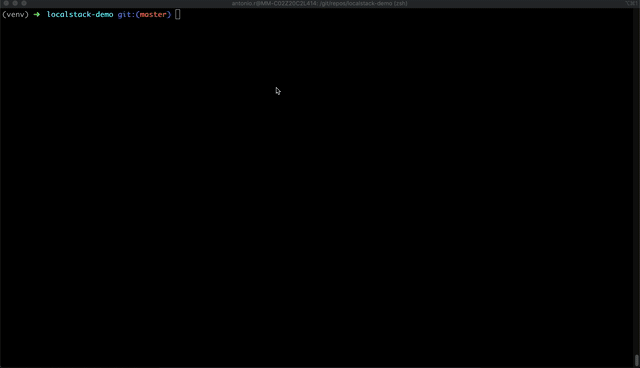

# Invoke a lambda function to upload an image to S3

This example shows how to invoke a lambda function to upload an image to S3

## Requirements

You should have installed:

- Install Docker if you haven't already.
- Install Serverless framework.
- Install the AWS CLI. Although we aren't going to work with "real" AWS, we'll need it to talk with our local docker containers.
- Once the AWS CLI is installed, run the following command to create some credentials. You can use real credentials, or dummy ones. Localstack requires that these values are present, but it doesn't actually validate them.
```bash
aws configure
```
- (Optional) AwsLocal: A thin wrapper around the aws command line interface for use with LocalStack.
- Serverless-localstack plugin: https://github.com/localstack/serverless-localstack.

## Prepare environment

Run Localstack. You can customize it in docker-compose.yml file.
```bash
docker-compose up -d
```

We need to create the S3 bucket where we are going to upload the image 

```bash
sh prepare_environment.sh
```
## Deploy

In order to deploy the example, simply run:

```bash
sls deploy --stage local --region us-east-1
```
## Usage

We can invoke the lambda function with the following command:
```bash
sls invoke -f uploadImageToS3 --stage local
```

The output should be like that:
```bash
Serverless: Using serverless-localstack
{
    "path": "images/upload.png"
}
```

Where the path is the route to access to the file. So just open your browser and type:

http://localhost:4572/tutorial/images/upload.png



## References

Localstack: https://github.com/localstack/localstack
Serverless: https://serverless.com
Localstack Serverless Plugin: https://github.com/localstack/serverless-localstack
AWS CLI: https://docs.aws.amazon.com/cli/latest/reference/